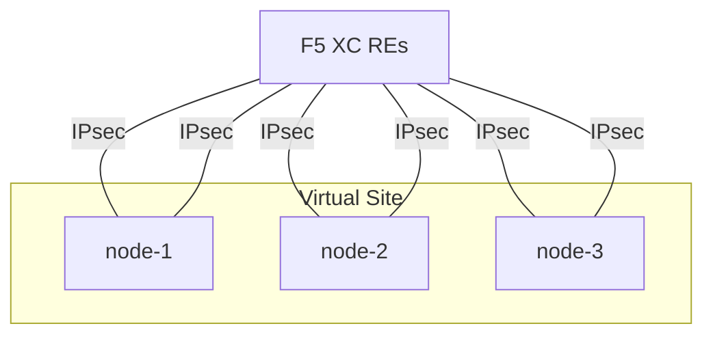
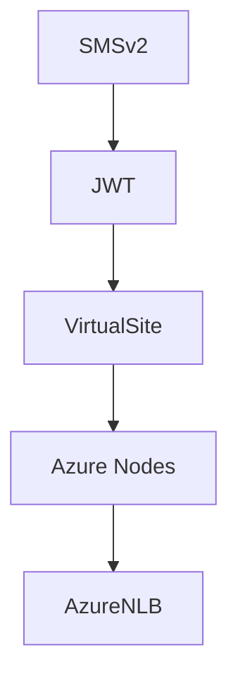
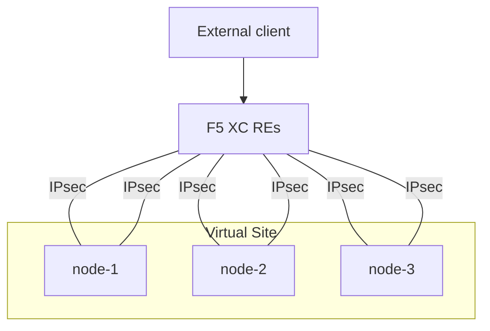
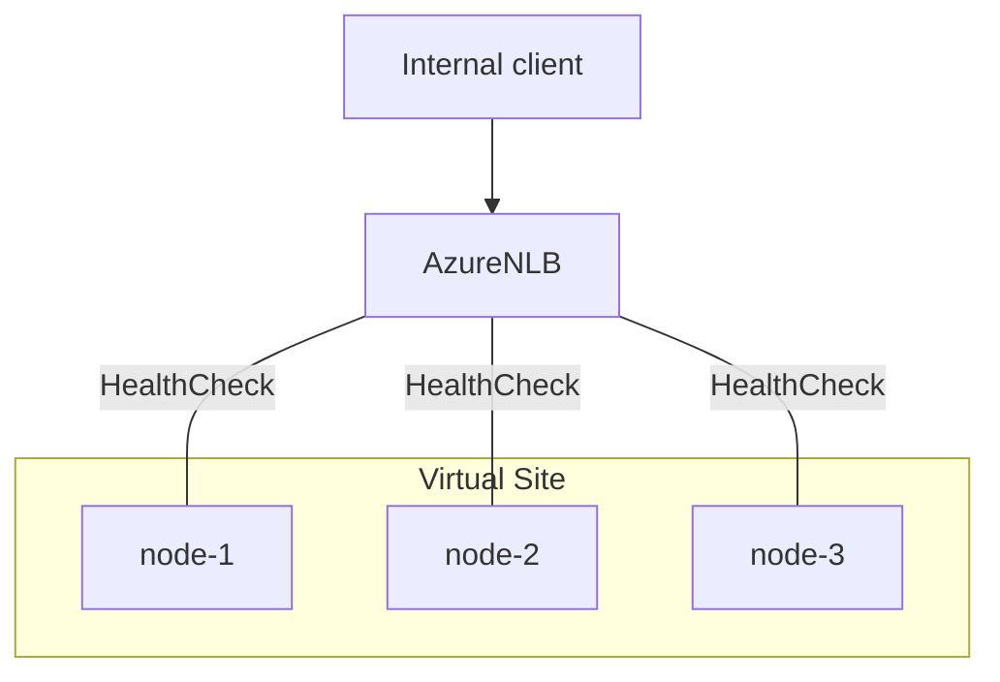

# Description
This Terraform code builds F5 Distributed Cloud (XC) and deploys three single-node CE clusters in Azure.


# Assumptions
## Existing VNET and subents
The project requires an existing VNET and subnets; SLO (Outside) and SLI (Inside)

## Intra node connectivity
The traffic is allowed between CE nodes

## Egress connectivity for Data and Management Planes
All traffic is allowed to F5 XC cloud: https://docs.cloud.f5.com/docs/reference/network-cloud-ref

# Objects deployed
| Component             | Description                |
|-----------------------|----------------------------|
| F5 XC SMSv2 objects   |CE cluster objects          |
| F5 XC JWT tokens      |JWT tokens used for registration|
| Virtual Site          |XC clustering               |
| Azure VM nodes        |Azure Instances             |
| Azure NLB             |Azure Network Load Balancer |

# High-Level
## Creation order


# Usage
## F5 XC Authentication
Generate and download API certificate for Service Credential account. Make sure the service credential has a correct write permissions to System namespace.

### Export .p12 password in your ADO
```
export VES_P12_PASSWORD=<your_password>
````
### Download and place the p12 into global directory 
```
cp xxx.p12 global/p12.p12
```

## terraform.tfvars
Fill terraform.tfvars with the required variables. 
```
vim terraform.tfvars
```

## Execute Terraform from required environment
```
cd environment/prod
```

```
terraform init
```

```
terraform plan
```

```
terraform apply
```

# Traffic Flows

## RE + CE (External clients)



## CE-only (Internal clients)

